本作业实现用户管理系统的基本功能，实现用户信息的增删改查。
但暂未实现用户界面的优化，以及入力用户信息时的合法性检查。

实现的页面如下：

#### 1.用户列表
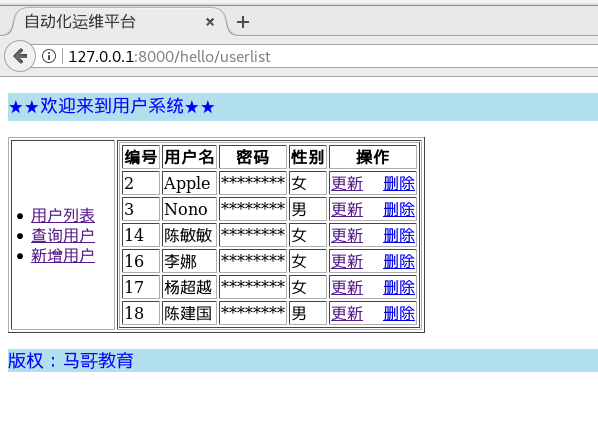

#### 2.点击查询用户

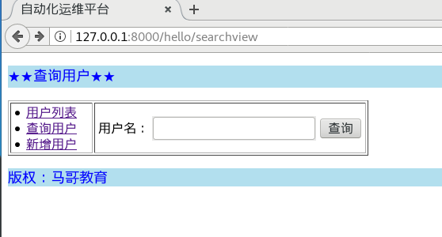
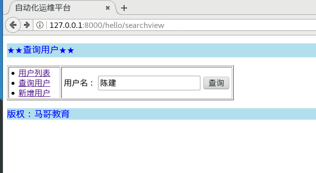
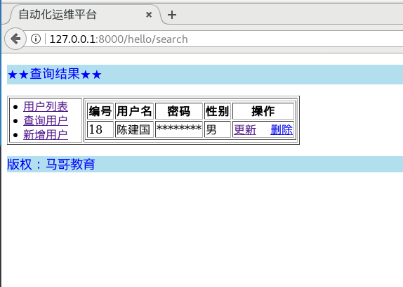


#### 3.点击新增用户

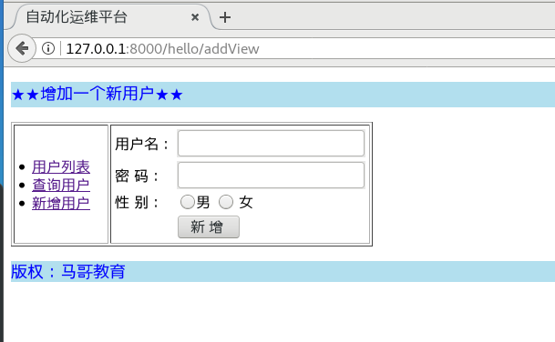
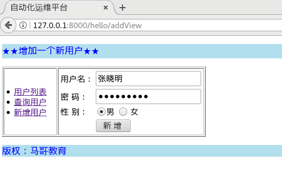
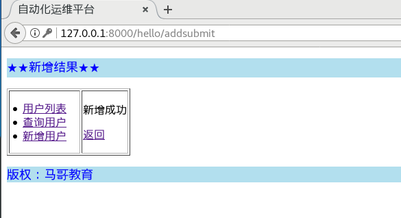
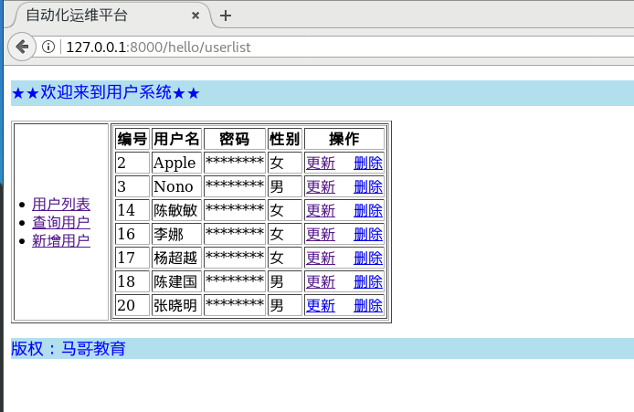

#### 4.更新用户

张晓明行 点 更新

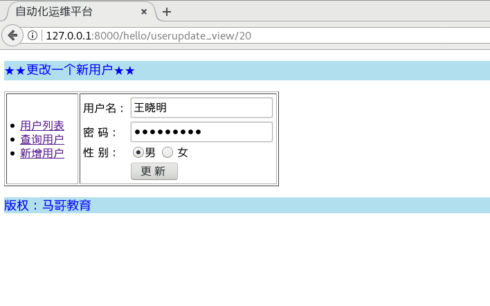
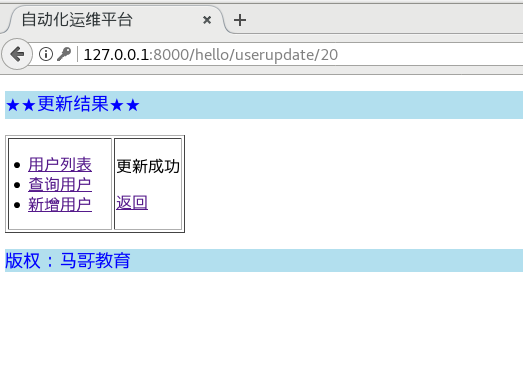
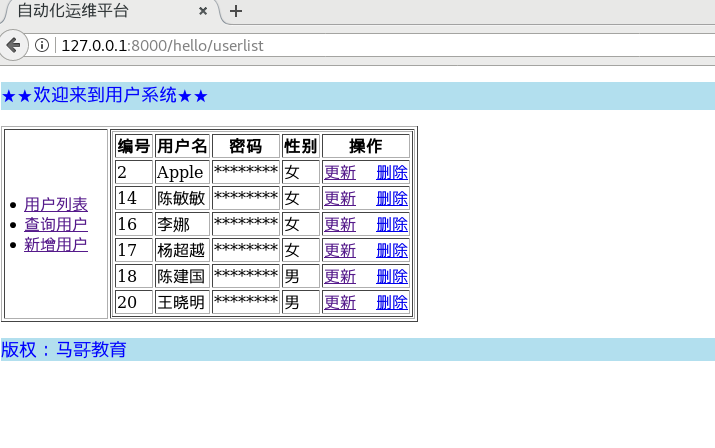


#### 4.删除用户
删除王晓明，王晓明行点删除

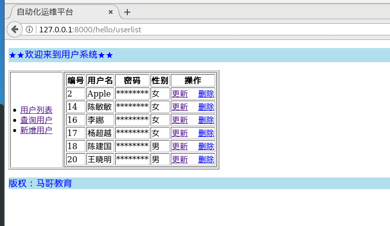
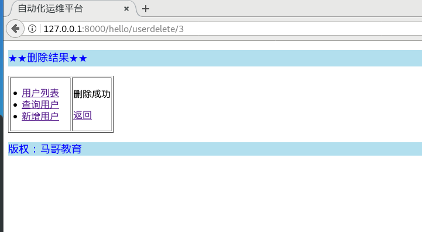
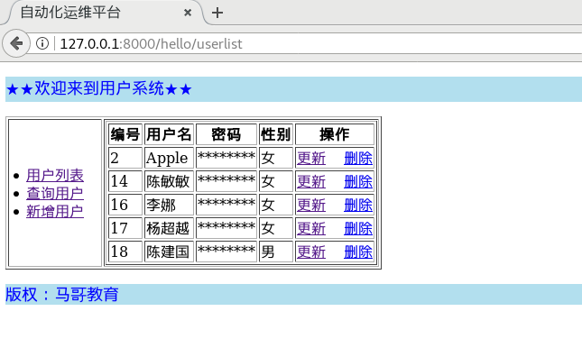


## ==**实现过程**==：

#### **======ORM 建表过程======**

1.编辑appname/models.py中定义要建立的表
```
$ cat hello/models.py
from django.db import models  # 建立创建表的类
class User(models.Model):
	SEX = (
	('0', '男'),
	('1', '女'),
	)
	name = models.CharField(max_length = 20,
	help_text="用户名")
	password = models.CharField(max_length = 32, help_text="密码")
	sex = models.IntegerField(choices = SEX, null=True, blank=True)
# 数据库存 0,1 ,展示男女
def __str__(self):
	return self.name
```
2. python manage.py makemigrations appname  # 生成迁移脚本
```
(py369) [python@julia devops]$ python manage.py makemigrations hello
Migrations for 'hello':
  hello/migrations/0001_initial.py
    - Create model User
(py369) [python@julia devops]$ cat hello/migrations/0001_initial.py 
# Generated by Django 2.2 on 2020-04-02 08:18

from django.db import migrations, models


class Migration(migrations.Migration):

    initial = True

    dependencies = [
    ]

    operations = [
        migrations.CreateModel(
            name='User',
            fields=[
                ('id', models.AutoField(auto_created=True, primary_key=True, serialize=False, verbose_name='ID')),
                ('name', models.CharField(help_text='用户名', max_length=20)),
                ('password', models.CharField(help_text='密码', max_length=32)),
                ('sex', models.IntegerField(blank=True, choices=[('0', '男'), ('1', '女')], null=True)),
            ],
        ),
    ]
```
3) python manage.py sqlmigrate appname 0001 # 展示迁移的sql语句
```
(py369) [python@julia devops]$ python manage.py sqlmigrate hello 0001
BEGIN;
--
-- Create model User
--
CREATE TABLE `hello_user` (`id` integer AUTO_INCREMENT NOT NULL PRIMARY KEY, `name` varchar(20) NOT NULL, `password` varchar(32) NOT NULL, `sex` integer NULL);
COMMIT;
```

4) python manage.py migrate # 执行数据库命令
```
(py369) [python@julia devops]$ python manage.py migrate hello
Operations to perform:
  Apply all migrations: hello
Running migrations:
  Applying hello.0001_initial... OK
(py369) [python@julia devops]$ 
```
5) python manage.py showmigrations #所有的app及对应的已经生效的migration

```
(py369) [python@julia devops]$ python manage.py showmigrations
admin
 [X] 0001_initial
 [X] 0002_logentry_remove_auto_add
 [X] 0003_logentry_add_action_flag_choices
auth
 [X] 0001_initial
 [X] 0002_alter_permission_name_max_length
 [X] 0003_alter_user_email_max_length
 [X] 0004_alter_user_username_opts
 [X] 0005_alter_user_last_login_null
 [X] 0006_require_contenttypes_0002
 [X] 0007_alter_validators_add_error_messages
 [X] 0008_alter_user_username_max_length
 [X] 0009_alter_user_last_name_max_length
 [X] 0010_alter_group_name_max_length
 [X] 0011_update_proxy_permissions
contenttypes
 [X] 0001_initial
 [X] 0002_remove_content_type_name
hello
 [X] 0001_initial
sessions
 [X] 0001_initial
(py369) [python@julia devops]$ 
```

确认：进入database可以看见这个表已经存在：
```
Database changed
mysql> show tables;
+----------------------------+
| Tables_in_devops           |
+----------------------------+
| auth_group                 |
| auth_group_permissions     |
| auth_permission            |
| auth_user                  |
| auth_user_groups           |
| auth_user_user_permissions |
| django_admin_log           |
| django_content_type        |
| django_migrations          |
| django_session             |
| hello_user                 |
+----------------------------+
11 rows in set (0.00 sec)

mysql> 
```

#### ==创建模型 ---hello/models.py==


```python
from django.db import models

# Create your models here.
class User(models.Model):
    SEX = (
        ('0', '男'),
        # 建立创建表的类
        ('1', '女'),
    )
    name = models.CharField(max_length=20,
                            help_text="用户名")
    password = models.CharField(max_length=32, help_text="密码")
    sex = models.IntegerField(choices=SEX, null=True, blank=True)

    def __str__(self):
        return self.name
```

#### ==配置路由 --- hello/urls.py==
```
from django.urls import path,re_path
from . import views

urlpatterns = [
    path('', views.index),
    path('userlist', views.list),          #列出所有用户
    path('addView', views.add_view),       #添加用户页面
    path('addsubmit', views.add_submit),   #添加用户后点提交动作的页面
    path('searchview', views.search_view), #查询用户页面
    path('search', views.search),          #查询用户后点提交动作的页面
    re_path('userupdate_view/([0-9]{1,5})', views.update_view),#更新用户操作的页面
    re_path('userupdate/([0-9]{1,5})', views.update),          #更新用户操作后点提交的页面
    re_path('userdelete/([0-9]{1,5})', views.delete),          #删除用户操作的页面
]
```
#### ==视图动作 ---hello/views.py==

```python
from django.shortcuts import render
from django.http import HttpResponse,QueryDict
from django.shortcuts import render
from hello.models import User


def index(request):
    return render(request, 'hello/hello.html')

#将所有用户列出#
def list(request):
    user = User.objects.all()
    return render(request, 'hello/list.html', {'user':user})

#新增用户界面#
def add_view(request):
    return render(request, 'hello/add.html')

#新增用户后提交动作#
def add_submit(request):
    try:
        if request.method == "POST":
            data = QueryDict(request.body).dict()
            data.pop('csrfmiddlewaretoken')
            print(data)
            res = User.objects.get_or_create(**data)
            if res:
                res = 1
                return render(request,'hello/addResult.html',{'res':res})
    except:
        res = 0
        return render(request,'hello/addResult.html',{'res':res})

#更新用户界面#
def update_view(request,uid):
    print(request.method,uid)
    user = User.objects.get(id=uid)
    return render(request, 'hello/update.html',{'user':user})

#更新用户后提交动作#
def update(request,uid):
    print(uid)
    if request.method == "POST":
        data = QueryDict(request.body).dict()
        data.pop('csrfmiddlewaretoken')
        print(data)
        res = User.objects.filter(id=uid).update(**data)
    return render(request, 'hello/updateResult.html', {'res': res})

#删除用户动作#
def delete(request,uid):
    print("uid is:",uid)
    print(request.method)
    u = User.objects.get(id=uid)
    res = u.delete()
    return render(request, 'hello/deleteResult.html', {'res': res})

#查询用户界面#
def search_view(request):
    return render(request,'hello/search.html')

#查询用户后的提交动作#
def search(request):
    print("hello this is search function")
    print(request.body)
    if request.method == "POST":
        data = QueryDict(request.body).dict()
        print(request.method, data)
        data.pop('csrfmiddlewaretoken')
        #print(data)
        user = User.objects.filter(name__icontains = data.get('name'))
        print(user)
        return render(request, 'hello/searchResult.html',{'user': user})

```

#### ==templates 下的模板结构==
```
devops/templates/
└── hello
    ├── add.html
    ├── addResult.html
    ├── base.html
    ├── deleteResult.html
    ├── hello.html
    ├── list.html
    ├── search.html
    ├── searchResult.html
    ├── update.html
    └── updateResult.html
```
#### ==base 模板--templates/base.html==

```
<!DOCTYPE html>
<html lang="en">
<head>
    <meta charset="UTF-8">
    <title>自动化运维平台</title>
</head>
<body>
<p style="background-color:#B2DFEE;">
    <font size="4" color="blue">
         用户列表 
    </font>
</p>

<table border="1">
    <tr>
        <td align="middle" width="100">
            <li><a href="/hello/userlist"> 用户列表 </a></li>
            <li><a href="/hello/searchview"> 查询用户 </a></li>
            <li><a href="/hello/addView"> 新增用户</a></li>
        </td>
        <td>
        
        
        </td>
   </tr>
</table>
<p style="background-color:#B2DFEE;"><font size="4" color="blue">
    版权：马哥教育</font>
</p>
</body>
</html>
```
#### ==显示用户列表 ---templates/list.html==
```
<!-- 继承母母版不不变的部分 -->


<!-- 重写母母版变的部分 -->
<p style="background-color:yellow;">
 ★★欢迎来到用户系统★★ 
</p>

<!-- 重写母母版变的部分 -->


<table border="1">
    <thead>
        <tr>
            <th>编号</th>
            <th>用户名</th>
            <th>密码</th>
            <th>性别</th>
            <th>操作</th>
        </tr>
    </thead>
    <tbody>
       
        <tr>
            <td>{{ u1.id }} </td>
            <td>{{ u1.name }} </td>
            <td>********</td>
            <td>
                
                女
                
                男
                
            </td>
            <td><a href="/hello/userupdate_view/{{ u1.id }}">更新</a>&nbsp&nbsp&nbsp
                <a href="/hello/userdelete/{{ u1.id }}">删除</a></td>
        </tr>
        
    </tbody>
</table>

```


#### ==新增用户---templates/add.html==
```
<!-- 继承母母版不不变的部分 -->


<!-- 重写母母版变的部分 -->
<p style="background-color:yellow;">
 ★★增加一个新用户★★ 
</p>

<!-- 重写母母版变的部分 -->

<form action="/hello/addsubmit" method="post">
    
    <table>
        <tr>
            <td>用户名：</td>
            <td><input type="text" name="name"></td>
        </tr>
        <tr>
            <td>密  码：</td>
            <td><input type="password" name="password"></td>
        </tr>
        <tr>
            <td>性  别：</td>
            <td><input type="radio" name="sex" value=0 >男 <input type="radio" name="sex" value=1 > 女 </td>
        </tr>
        <tr><td></td></td><td><input type="submit" value="&nbsp;新&nbsp;增&nbsp; " /></td></tr>
    </table>
</form>


```

#### ==新增用户提交按钮后返回的页面（成功/失败）--templates/addResult.html==
```
<!-- 继承母母版不不变的部分 -->


<!-- 重写母母版变的部分 -->
<p style="background-color:yellow;">
 ★★新增结果★★ 
</p>

<!-- 重写母母版变的部分 -->


<p>新增成功</p>

<p>新增失败</p>

<p><a href="/hello/addView">返回</a></p>


```
#### ==更新用户页面--templates/update.html==

```
<!-- 继承母母版不不变的部分 -->


<!-- 重写母母版变的部分 -->
<p style="background-color:yellow;">
 ★★更改一个新用户★★ 
</p>

<!-- 重写母母版变的部分 -->

<form action="/hello/userupdate/{{user.id}}" method="post">
    
    <table>
        <tr>
            <td>用户名：</td>
            <td><input type="text" name="name"  value={{ user.name }}></td>
        </tr>
        <tr>
            <td>密  码：</td>
            <td><input type="password" name="password" value={{ user.password }}></td>
        </tr>
        <tr>
            <td>性  别：</td>
            <td><input type="radio" name="sex" value=0 >男 <input type="radio" name="sex" value=1 > 女 </td>
        </tr>
        <tr><td></td></td><td><input type="submit" value="&nbsp;更&nbsp;新&nbsp; " /></td></tr>
    </table>
</form>

```
#### ==更新用户信息后提交页面（成功/失败）--templates/updateResult.html==

```
<!-- 继承母母版不不变的部分 -->


<!-- 重写母母版变的部分 -->
<p style="background-color:yellow;">
 ★★更新结果★★ 
</p>

<!-- 重写母母版变的部分 -->



<p>更新成功</p>

<p>更新失败</p>

<p><a href="/hello/userlist">返回</a></p>

```
#### ==删除用户后返回页面（失败/成功）--templates/deleteResult.html==
```
<!-- 继承母母版不不变的部分 -->


<!-- 重写母母版变的部分 -->
<p style="background-color:yellow;">
 ★★删除结果★★ 
</p>

<!-- 重写母母版变的部分 -->



<p>删除成功</p>

<p>删除失败</p>

<p><a href="/hello/userlist">返回</a></p>


```

#### ==查询用户界面--templates/search.html==
```
<!-- 继承母母版不不变的部分 -->


<!-- 重写母母版变的部分 -->
<p style="background-color:yellow;">
 ★★查询用户★★ 
</p>

<!-- 重写母母版变的部分 -->

<form action="/hello/search" method="post">
    
    <table>
        <tr>
            <td>用户名：</td>
            <td><input type="text" name="name" ></td>
            <td><input type="submit" value="查询"></td>
        </tr>
    </table>
</form>

```

#### ==查询用户返回查询结果界面--templates/searchResult.html==

#### ==设置---devops/settings.py==
```python

ALLOWED_HOSTS = ['*']
...

MIDDLEWARE = [
    'django.middleware.security.SecurityMiddleware',
    'django.contrib.sessions.middleware.SessionMiddleware',
    'django.middleware.common.CommonMiddleware',
    # 'django.middleware.csrf.CsrfViewMiddleware',
    'django.contrib.auth.middleware.AuthenticationMiddleware',
    'django.contrib.messages.middleware.MessageMiddleware',
    'django.middleware.clickjacking.XFrameOptionsMiddleware',
]
...

TEMPLATES = [
    {
        'BACKEND': 'django.template.backends.django.DjangoTemplates',
        'DIRS': [BASE_DIR+"/templates"],
        'APP_DIRS': True,
        'OPTIONS': {
            'context_processors': [
                'django.template.context_processors.debug',
                'django.template.context_processors.request',
                'django.contrib.auth.context_processors.auth',
                'django.contrib.messages.context_processors.messages',
            ],
        },
    },
]

...

DATABASES = {
    'default': {
        'ENGINE': 'django.db.backends.mysql',
        'NAME': 'devops',
	'HOST': '127.0.0.1',
	'USER': 'root',
	'PASSWORD': 'DevOps@2020',
	'PORT': '3306',
    }
}
...
LANGUAGE_CODE = 'zh-hans'

TIME_ZONE = 'Asia/Shanghai'

```
